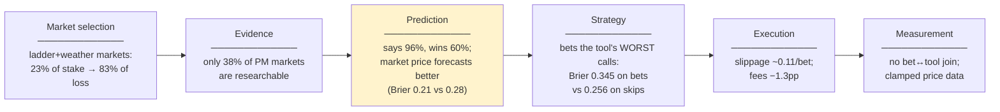
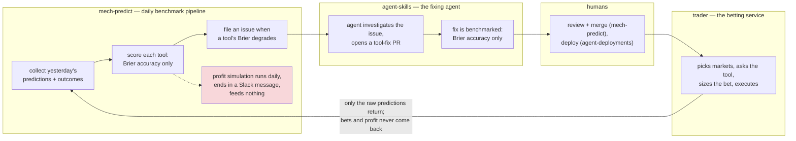
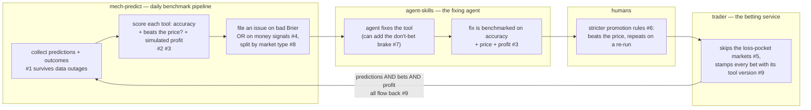

# ROI Loop Plan — extending the tool loop beyond forecast scores

> **Status:** proposal, not yet implemented. Numbers from internal trading analysis, Apr–Aug 2026 (Polymarket primary).

## 1. The problem

**The loop got better at forecasting and it made no money.** Tool Brier improved 0.320 → 0.270 with zero ROI movement — because ROI is decided in six boxes, and the loop watches only one of them, with one number.

**A good Brier score is a necessary condition, but not a sufficient one.** A tool must forecast well to make money — but it also has to beat the market price, on markets worth betting, at costs we can afford. The loop must start checking all of it.

## 2. The fix

**Judge every tool change the way the trader experiences it: did it beat the market price, on the markets we actually bet, after costs? Measure that by replaying past markets, and add the one fix already proven to make money: skip the market types where we lose.**

**Before** — the loop sees only forecasting accuracy; what the trader wins or loses never comes back:

**After** — the benchmark judges money, not just accuracy (#2–#4); the trader stops taking known-bad bets and stamps every bet with its tool (#5, #9); guard rails tighten at every stage (#1, #6, #7, #8):

## 3. The changes

Labels: [READY] = evidence is in, build now · [RESEARCH-FIRST] = answer its question in section 5 first.

| # | Change | Repo | Box | Why (the number that proves it) | Size |
|---|--------|------|-----|-------------------------------|------|
| 1 | **Make the daily pipeline survive outages.** One platform's failure must not stop the others, and reports must never present stale data as fresh [READY] | mech-predict | Measurement | One platform's subgraph outage silenced the whole loop for 7 straight days while daily reports kept looking healthy | M |
| 2 | **Keep the market price when replaying.** The stored data has it; the replay step drops it. ~3 lines of code [READY] | mech-predict | Measurement | Every change below compares tools against the market price — the data already exists | S |
| 3 | **Judge tools against the market price.** Benchmark reports gain three columns: beats the price? right when it disagrees? would it have made money? [READY] | mech-predict | Prediction | A tool can improve its Brier score and still lose to the price on every market we'd bet | M |
| 4 | **Open issues on money signals**, not just accuracy: the tool is worst exactly where we bet, or its simulated profit is clearly negative [READY] | mech-predict | Strategy | Brier 0.345 on the markets we bet vs 0.256 on the ones we skip; win rate falls 72% → 30% as claimed advantage grows | S |
| 5 | **Stop betting the two market types where we lose most**: linked "above $N" question families and weather favourites. Reports keep monitoring them [READY] | trader + mech-predict (monitoring) | Market selection | The only fix validated to recover money: −7.3% → +0.3% on held-back data. Also stops paying for forecasts we shouldn't buy | M |
| 6 | **Stricter promotion rules.** Promote only a tool that beats the price, is usually right when it disagrees with it, and repeats the win on a second run — measured on data whose prices the trader hasn't pre-filtered [READY] | mech-predict + agent-skills | Governance | Two past promotions failed to repeat; one mislabeled report column nearly promoted tools that lose to the price | S |
| 7 | **The "don't bet" brake, in non-breaking steps.** New tool versions accept market info as an *optional* input (nothing passed → behave exactly as today), assess researchability and market status, and add *optional* output fields like "worth betting?" — ignored by today's trader. Later the trader opts in to honor them (and its always-bets fallback is fixed) [RESEARCH-FIRST] | mech-predict (tools) + trader (opt-in later) | Prediction + Strategy | Price-informed tools cut bets 424 → 105 and improved returns ~+26 points (small sample — needs a forward test) | M |
| 8 | **Only ask questions research can answer.** Many markets can't be researched: "will a podcast guest say word X" (speech-habit guessing), short-term price moves (news is already in the price), sports (the odds beat anything our tools read). Build a classifier labeling every market researchable-or-not: (a) split reports and issues by it [READY]; (b) later, let the trader skip the rest [RESEARCH-FIRST] | (a) mech-predict · (b) trader | Market selection | In an internal study, only 38% of Polymarket markets were researchable — and 42% of forecast spend went where research cannot help | M |
| 9 | **Stamp every bet with the tool that produced it** [READY] | trader | Measurement | Today not one dollar of profit or loss can be attributed to a tool version; a badly broken release stayed invisible for 12 days | M |

### Already in flight

Two open PRs on the **daily Slack report** are early pieces of this plan: [#433](https://github.com/valory-xyz/mech-predict/pull/433) makes the report's numbers computed rather than transcribed (trustworthy inputs), and [#445](https://github.com/valory-xyz/mech-predict/pull/445) adds a promote/demote recommendation built on exactly the section-3 signals — edge over the market price with a statistical floor, plus accuracy-when-disagreeing. This plan does not duplicate them: #3 extends the same judgment from the daily report to **benchmark verdicts on candidate fixes**, and #6 adopts #445's gate as the promotion bar and adds the repeat-run and clean-data rules.

## 4. Rollout stages — nothing interferes with what is deployed

**Every change ships without touching the running system**: loop changes live in reporting and benchmarks; tool changes are new versions with optional inputs/outputs; trader changes sit behind switches that are off by default.

| Stage | What ships | Why it cannot break anything |
|---|---|---|
| 0 | Loop plumbing: #1 #2 #3 #4 #6 | Lives entirely in the benchmark pipeline; no deployed service touched |
| 1 | Tools *accept* market info + *assess* the question (#7): researchable? worth betting? | Optional input — nothing passed → tool behaves exactly as today |
| 2 | Tools *output* extra fields: "worth betting?", "researchable?" (#7, #8) | The trader ignores unknown output fields — zero effect until read |
| 3 | Trader opt-ins: honor "worth betting?" + fix the fallback (#7), skip loss pockets (#5), stamp bets (#9) | Each behind a configuration switch, off by default; flipped one at a time |

## 5. Establish first (research before building)

| # | Question | Acceptance | Unblocks |
|---|---|---|---|
| R1 | Does the "don't bet" gain repeat on fresh markets — and do abstaining answers really produce zero bets through the trader? | Gain clearly positive after allowing for luck; abstain answers place no bets end-to-end | #7 |
| R2 | Does simulated profit rank tools the same way real profit does? | Same winners and losers for every tool with ≥30 bets over one window | trust in #3/#4 |
| R3 | Does skipping non-researchable markets add profit on top of skipping the loss pockets? | Replayed profit difference clearly positive after allowing for luck | #8b |
| R4 | Which trigger thresholds catch the bad periods without crying wolf on the good ones? | Back-test: fires on known-bad windows, zero false alarms on known-good | #4 |
| R5 | Do the loss-pocket definitions still hold next month, as the market mix shifts? | A month of fresh data at break-even or better with the gate on | #5 |

**Success =** the loop's question changes from *"is the forecast more accurate?"* to *"would this tool have made money on the markets we actually bet, after costs?"*

---

## Appendix A — the signals we need (all already computed)

None of this needs new data collection — the signals exist today and never reach a decision.

| What we need to know | Where it exists | Where it goes today | Where it should go |
|---|---|---|---|
| Does the tool beat the market price? | daily scorer | report tables only | verdicts (#3), promotion (#6) |
| When the tool disagrees with the price, who turns out right? | daily scorer | report tables only | verdicts (#3), promotion (#6) |
| Would this tool have made money? | daily profit simulation | a Slack message | verdicts (#3), issues (#4) |
| Do we bet exactly where the tool is most wrong? | daily profit simulation | nowhere | issues (#4) |
| The market price at the moment of each prediction | stored with 96% of predictions | dropped when replaying | replay rows (#2) |

## Appendix B — what we will NOT do (tried, measured, rejected)

- **More tuning of betting knobs** (edge floors, Kelly fractions, stake curves) — ten replay experiments; every winner fell apart on data it wasn't tuned on.
- **"Correcting" tool probabilities after the fact** — flattens all answers toward the average; destroys the ability to tell likely from unlikely. Measured worse.
- **Using live trading profit as the loop's success measure** — our bets move together so much that effects under ~5 points are invisible live; the loop judges on replayed/simulated profit.
- **Chasing Brier-score trends** — Brier improved with zero profit effect; Brier trends mislead when most markets drift toward resolving NO.
- **Changing the tool response format in a breaking way** — the four required fields never change; new signals ride as optional extras today's trader ignores.
- **Rewriting the trader's prompt** — the market context already travels with every request; consuming it is tool-side work.
- **Using Omen as a benchmark for Polymarket tools** — tools are deployed per platform; an Omen score says nothing about a Polymarket-only tool.
- **Filing Omen improvement issues** — Omen scoring is confounded by the on-chain resolution mech; loop issues stay Polymarket-only.
- **Execution overhaul** (limit orders, slippage bounds) — promising but a separate trader workstream.
- **Leaving Polymarket** — most of the headline Omen-vs-PM gap was a measurement artifact; at matched execution costs the platforms are roughly level.

## Appendix C — working rules

- **The coding agent works on one repo (mech-predict tools).** Stages 1–2 are pure tool work it ships alone. When a fix genuinely needs both repos, the agent proposes both halves (tool PR + written spec) and a human lands the trader side. Trader changes (stage 3) are one-time human PRs.
- **Honest measurement**: a rule may only use information the trader has at betting time; accuracy trends measured in ways not fooled by base-rate drift; error bars account for bets winning and losing together; every promotion needs a repeat run.
