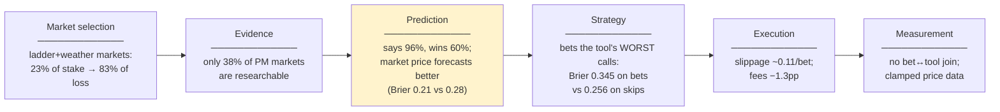

# ROI Loop Plan — extending the tool loop beyond forecast scores

> **Status:** proposal v2, 2026-08-25 — restructured after review. Numbers from internal trading analysis, Apr–Aug 2026 (Polymarket primary).

## 1. The problem

**The loop got better at forecasting and it made no money.** Tool Brier improved 0.320 → 0.270 with zero ROI movement — because ROI is decided in six boxes, and the loop watches only one of them, with one number.

**A good Brier score is necessary, but not sufficient.** A tool must forecast well to make money — but it also has to beat the market price, on markets worth betting, at costs we can afford.

## 2. The rules

1. **Tools emit forecast signals only** — probabilities and objective properties of the question (e.g. "is it researchable"). **The trading engine makes every decision.** No tool ever signals bet / don't-bet, in any wording.
2. **Market data may be given to a tool as an *optional* input** — the tool must work exactly as today when it isn't.
3. **Nothing interferes with current deployments** — tool changes are new versions; trader changes sit behind switches that are off by default.
4. **Manual first, automation later** — improvements ship as direct PRs; the automated agent loop adopts a recipe only after it is proven.

## 3. Prioritized actions (each in one box, ranked by impact and effort)

| Priority | Action | Box | Impact | Effort |
|---|--------|-----|--------|--------|
| **1** | **Upgrade one tool, by hand**: pass it the market information (optional input) and let it determine whether the question is researchable — and use both to build a better prediction | Prediction | High | Med |
| **2** | **A/B test that tool**: original vs upgraded on the same past markets, using local replay benchmarking (small prerequisite: stop dropping the market price from replay rows — ~3 lines) | Measurement | High — the go/no-go evidence | Med |
| 3 | **Fix the daily pipeline** so one platform's outage doesn't stop everything and reports never show stale data as fresh (broken ~10 days in August) | Measurement | High | Med |
| 4 | **Stop betting the two market types holding ~83% of the loss** (linked "above $N" families, weather favourites) — trader configuration, off by default | Market selection | Highest proven (−7.3% → +0.3% replayed) | Med |
| 5 | **Judge tools on money in every benchmark** — beats the price? right when it disagrees? simulated profit? — and open issues on those signals too | Measurement | Compounding | Med |
| 6 | **Stricter promotion**: beats the price and repeats the win on a second run, measured on unfiltered price data | Measurement | Med | Small |
| 7 | **Stamp every bet with the tool version that produced it** — today no profit or loss is attributable to a tool version | Measurement | Med | Med |

**Start with 1 → 2 this week.** 3 and 4 are independent and can run in parallel. 5–7 follow. (Open PRs #433/#445 — computed daily-report tables + promote/demote — are early pieces of 5 and 6.)

**Success for 1–2:** the upgraded tool beats the original on the same markets — on accuracy *and* against the market price. Then promote it and repeat the recipe on the next tool.

## 4. Quick wins on the displayed metrics (independent of the loop)

The website's ROI / accuracy / Brier numbers can improve this week without any change to tools or strategy:

| Action | Box | Impact | Effort |
|--------|-----|--------|--------|
| **Fix the website ROI calculation** *(AI-generated finding — to be verified before acting)*. On an audited trader the site showed **−19.3% where the true figure is −10.5%** — and repairing the formula reproduces the true figure exactly. Three verified defects: (a) it reads a payout field the indexer **stopped filling in May**, so every win settled since is missing from the payout side; (b) mech costs are **counted twice** (legacy + marketplace request counters carry the same number); (c) it only sees old-style bets — **4.8% of all bets (newer accounts) are invisible**, and 8 live traders bet exclusively the new way, so the formula shows **no ROI at all** for them | Measurement | High — displayed ROI, immediately | Low |
| **Collect unclaimed winnings** *(AI-generated finding — to be verified before acting)*. On the audited trader: **7 winning bets (~29 USDC) were never redeemed** — the agent can't tell "not yet claimable" from "worth nothing", so winnings sit uncollected while it also retries dead claims forever (437 of 536 redemption transactions paid exactly 0; worst case 173 in 36h on one lost market). Reading the wallet instead of the bets overstated that trader's loss by **11 points** (−20.9% cash vs −9.7% real). Fleet-wide scale not yet measured | Execution | Med (audited case; fleet scale TBD) | Low |
| **Close the backup-betting loophole** *(AI-generated finding — to be verified before acting)*. In code, when the main strategy concludes "no advantage, don't bet", a fallback strategy can bet instead — and it checks nothing (no price, no advantage; a fixed amount on whichever side the tool favours). Both service configs ship this fallback OFF, but the agent-level default is ON. Action: confirm the live deployments really run it off, then make the fallback respect a "don't bet" outcome so it can never fire | Strategy | Med (only if enabled in prod) | Low |

---

## Appendix A — signals we already compute (and throw away)

| What we need to know | Where it exists | Where it goes today |
|---|---|---|
| Does the tool beat the market price? | daily scorer | report tables only |
| Would this tool have made money? | daily profit simulation | a Slack message |
| Do we bet exactly where the tool is most wrong? | daily profit simulation | nowhere |
| The market price at each prediction | stored with 96% of predictions | dropped when replaying |

## Appendix B — what we will NOT do (tried, measured, rejected)

- **Tool-side bet advice** in any form — rule 1, non-negotiable.
- **More tuning of betting knobs** — ten replay experiments; every winner fell apart on fresh data.
- **"Correcting" tool probabilities after the fact** — flattens answers, destroys the ability to tell likely from unlikely.
- **Using live trading profit as the success measure** — effects under ~5 points are invisible live; judge on replayed/simulated profit.
- **Breaking the tool response format** — the four required fields never change; anything new is optional.
- **Using Omen to judge Polymarket tools** — tools are deployed per platform; each is judged on its own platform's data.
