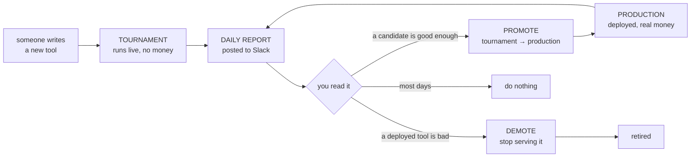

# Daily report — operator guide

What to do each morning with the benchmark report in Slack. This page is the whole
procedure; [PROPOSAL.md](PROPOSAL.md) is the design of the system it sits in.

---

## 1. How the loop works



Tools live in one of two places. **Tournament** tools answer real questions but no money
rides on them. **Production** tools are deployed and the trader bets on what they say.
Every night both are scored against what actually happened.

---

## 2. Reading the Slack messages

| Message | What it is |
|---|---|
| **Title** | The answer. Read this first |
| **1a / 1b** | Production tools — this week, and overall |
| **2. Tournament** | Candidates waiting to be promoted |
| **3. Alerts** | Reasons to *not* trust today's numbers |
| **ROI** | What the trader would have earned |

The title tells you the outcome before you read anything else:

| Title | Meaning |
|---|---|
| 🟢 **PROMOTE n** | a candidate is ready — act |
| 🟠 **DEMOTE n** | a deployed tool should be switched off — act |
| 🔴 **NO ACTION** | no deployed tool clears the gate. Switching them all off would leave nothing running — escalate, do not act tool-by-tool |
| ⚪ **NO CHANGE** | nothing to do |

**The four columns that decide anything**, plus one that qualifies them.

| Column | Reading |
|---|---|
| **Edge** | how far the tool beat the market price. Ranks the table — best first |
| **floor** | the *worst* Edge the evidence still supports. **This is what the gate tests**, not Edge |
| **condAcc** | win rate on the markets where the tool **disagreed** with the price — the only markets a bet is placed on |
| **n** | scored markets. Under 30, nothing is decided |
| **rel** | share of calls that returned a usable answer. Under 80% it is flagged as `(rel NN%)` on the row — a **warning, not a veto**: the score is computed only on the calls it *did* answer |

### Alerts mean "wait"

**`week still filling`** — a question only counts once it resolves, so this week's data has
not finished arriving. Ignore the weekly columns; use the cumulative ones.
A **`*`** on a tool means too few markets to judge. Do not act on it.

---

## 3. What to do

**The report already applies the gates.** The `rec` column is the recommendation — you are
checking it, not recalculating it.

> **PROMOTE** a tournament tool when it has **≥ 30 scored markets**, its **`floor` is above
> +0.04**, and its **`condAcc` is 50% or better**.

> **DEMOTE** a production tool when it has **≥ 30 scored markets**, does **not** clear that
> same floor, and **either** wins **under half** its disagreements **or** scores worse than
> its own no-skill baseline in **both** windows — **unless** demoting it would leave the
> platform with no tool at all.

Low reliability never decides either one. It rides along as `(rel NN%)` so you can see the
verdict was built on partial data, and you make the call.

If nothing clears the promote gate, **promote nothing**. Being top of the table is not a
reason to promote.

| `rec` says | You do |
|---|---|
| `PROMOTE` | promote it (below) |
| `demote: …` | demote it (below) |
| `review: …` | look, but do not promote — it cleared the floor and failed `condAcc` |
| `keep` | nothing |
| anything ending `(rel NN%)` | the verdict stands, but the tool is missing calls — check why before acting |
| `n=… < 30`, `no spread`, `needs --rebuild` | nothing — not enough data, or the scorer needs a rebuild |

### A `PROMOTE` is a nomination, not a green light

It means the candidate passed the **statistical** gate. Deployment still needs the rest of
[PROPOSAL.md](PROPOSAL.md) Part 10 — ablation, human review, then canary. Promoting **adds**
to the deployed set; it does not replace. Keep several tools live.

### Which repository

| Action | Where |
|---|---|
| **Deploy** a tool | 1. `mech-predict` — add to the service, merge, cut a release.<br/>2. `agent-deployments` — add to `TOOLS_TO_PACKAGE_HASH`, update `METADATA_HASH`, bump `PROPEL_SERVICE_HASH_ID`. **Order matters**: CI rejects a tool not yet in the released service |
| **Demote** a tool | `agent-deployments` only — remove from `TOOLS_TO_PACKAGE_HASH`, update `METADATA_HASH` |
| **Add a candidate** to the tournament | `mech-predict` only — add to `benchmark/tournament_tools.json` |

**If in doubt, do nothing.** A missed promotion costs a day. A wrong demotion takes a
working tool out of production.

---

# Appendix — why these metrics

## Why not just accuracy?

The point is for the trader to make money. It **bets bigger when a tool sounds more
confident**, so a tool's job isn't to pick the right side — it's to give honest odds that
beat the market's price. A tool can pick the right side 70% of the time and still lose
money if it sounds too sure on the ones it gets wrong: the trader bets big on those and
loses big. So tools are graded on how far they beat the price (**Edge**), and guarded
against the two ways a score flatters: being confident and wrong, and hedging to 50/50.

## `floor` — the number the gate actually tests

Each time a tool prices a market that later resolves, we record **one number**: how much
closer the tool was to the truth than the market price was. That is the market's Brier
score minus the tool's. Positive = the tool beat the price. **Edge** is the average of
those numbers. **`floor` is that average minus a safety deduction** — large when the tool
has few markets or its results swing wildly, small when thousands of markets agree.

```
floor  =  Edge  −  1.645 × ( spread ÷ √markets )
```

Two real tools, same report:

| tool | Edge | spread | markets | deduction | **floor** |
|---|---:|---:|---:|---:|---:|
| `factual_research` | −0.0256 | 0.262 | **6,938** | 0.005 | **−0.0308** |
| `superforcaster-polymarket-v2` | −0.1551 | 0.382 | **31** | **0.113** | **−0.2680** |

Same kind of spread — but the deduction is **22× larger** for the tool with 31 markets.
That is the entire column: *given how few markets this is, how bad could the true long-run
average still be?* Gating on `floor` rather than `Edge` means a tool must be good **and**
well-proven, not merely good-looking. A great average off 31 lucky markets does not clear it.

## Why the others

| Metric | Why it gates |
|---|---|
| **`rel`** (warning only) | The score is computed only on the calls that came back, and the missing ones are not a random sample. It is **not** a gate: a tool that misses calls may still be the best forecaster available, and blocking it can leave a worse one deployed |
| **`condAcc` ≥ 50%** | A tool that agrees with the price on easy questions scores well and earns nothing — the trader only bets where the tool **disagrees**. Losing over half of those is a coin flip with costs |
| **n ≥ 30** | Below it the report says *"not enough data yet"* — which is a different answer from *"no improvement"*, and must not be read as one |
| **Brier vs base** | The demote signal must show in **both** windows. One window is noise: a live tool once sat 0.0003 above its floor over 2,055 markets while winning 65% of its disagreements |

**Why +0.04, and why one-sided:** a false promote loses money; a missed promote just keeps
the incumbent for another day. The bar is deliberately asymmetric.

## Known limits

- The deduction assumes markets are independent. Ladder markets (*"above 100k / 110k /
  120k"*) resolve off one underlying event, so the true sample is smaller than `n` and the
  deduction is **too small**. Nothing corrects for this yet.
- `floor` renders from 2 markets but only gates from 30 — a spectacular bound on 5 markets
  is not actionable. Only `rec` knows that.
- The gate is re-tested daily against a slow-moving window, so the 95% is per-cell-per-day,
  not per-decision.
