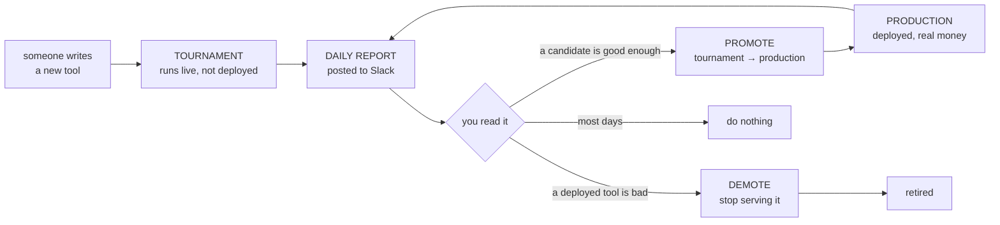
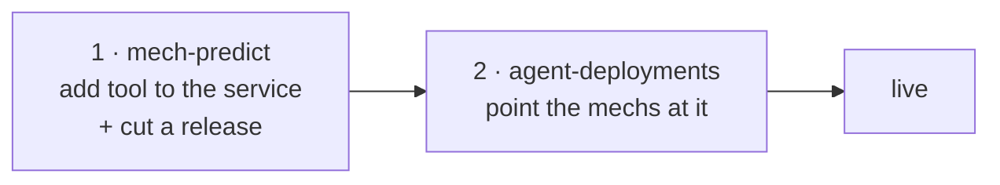

# Daily report — operator guide

What to do each morning with the benchmark report in Slack.
The statistics behind it live in [PROMOTE_DEMOTE_POLICY.md](PROMOTE_DEMOTE_POLICY.md); this
page is the daily routine.

---

## 1. How the loop works

Tools live in one of two places. **Tournament** tools are being tried out — they answer real
questions but no money rides on them. **Production** tools are deployed and the trader bets on
what they say. Every night both are scored against what actually happened, and the report tells
you whether anything should move between the two.

---

## 2. Reading the Slack messages

The report arrives as a few messages per platform. Read them in order and stop when you have
your answer — most days that is the first one.

| Message | What it is |
|---|---|
| **Title** | The answer. Read this first |
| **1a / 1b** | Production tools — how they did this week, and overall |
| **2. Tournament** | Candidates waiting to be promoted |
| **3. Alerts** | Reasons to *not* trust today's numbers |
| **ROI** | What the trader would have earned |

The title tells you the outcome before you read anything else:

| | meaning |
|---|---|
| 🟢 **PROMOTE n** | a candidate is ready — act |
| 🟠 **DEMOTE n** | a deployed tool should be switched off — act |
| 🔴 **NO ACTION** | every deployed tool is failing, but switching them all off would leave nothing running. Escalate, do not act tool-by-tool |
| ⚪ **NO CHANGE** | nothing to do |

### The columns that matter

Only three. Everything else is context.

- **`Edge`** — how much better the tool was than the market price. Above zero means it beat the
  price. This is what the tables are sorted by, best at the top.
- **`floor`** — the *worst case* for that Edge, allowing for luck and small samples. A tool is
  only promotable if this is comfortably above zero.
- **`condAcc`** — how often the tool was right *when it disagreed with the price*. Those are the
  only markets a bet is placed on. **Under 50% means a coin flip**, however good the rest looks.

Ignore `Brier` on its own. It looks like a score but it moves with how hard the questions were,
so a tool can look better simply because it had an easier week. That is why `Edge` exists.

### Alerts mean "wait"

If **`week still filling`** appears, this week's data has not finished arriving — a question only
counts once it resolves. Ignore the weekly columns that day and use the cumulative ones.

If a tool is marked **`*`**, it has too few markets to judge. Do not act on it.

---

## 3. What to do

**The report already applies the rules.** The `rec` column is the recommendation; you are
checking it, not recalculating it.

| `rec` says | You do |
|---|---|
| `PROMOTE` | promote it (below) |
| `demote: …` | demote it (below) |
| `keep` | nothing |
| `n=… < 30`, `no spread`, `needs --rebuild` | nothing — not enough data, or the scorer needs a rebuild |

### Before acting, three sanity checks

1. Is there an **alert** saying the data is not ready? → wait a day.
2. Is `condAcc` **under 50%**? → do not promote it, whatever else says.
3. Would demoting leave the platform with **no tool**? → the title says 🔴 NO ACTION. Escalate.

### To promote a tool — two repositories, in order

1. **`mech-predict`** — add the tool to the service's customs, merge, and cut a release.
2. **`agent-deployments`** — in each mech's env file, add the tool to `TOOLS_TO_PACKAGE_HASH`,
   update `METADATA_HASH`, and bump `PROPEL_SERVICE_HASH_ID` to the new release.

Order matters. CI in `agent-deployments` rejects a tool that is not in the released service yet.

### To demote a tool

**`agent-deployments`** only — remove it from that mech's `TOOLS_TO_PACKAGE_HASH` and update
`METADATA_HASH`. Nothing to change in `mech-predict`.

### To put a new candidate into the tournament

**`mech-predict`** only — add it to `benchmark/tournament_tools.json`. The next nightly run picks
it up. No deployment involved.

---

**If in doubt, do nothing.** A missed promotion costs a day. A wrong demotion takes a working
tool out of production.
