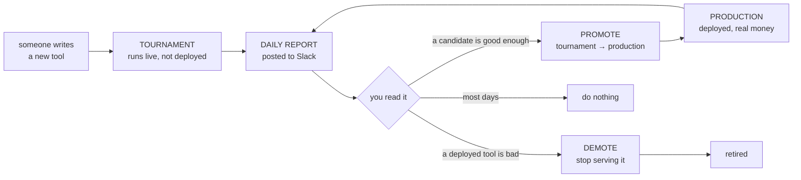
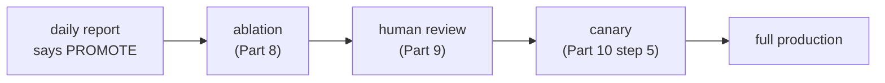
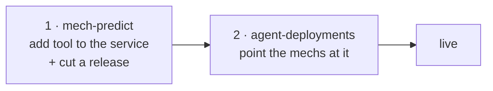

# Daily report — operator guide

What to do each morning with the benchmark report in Slack.

This is the **daily operating page** for one part of a larger system:

| Document | Answers |
|---|---|
| [PROPOSAL.md](PROPOSAL.md) | how the whole loop is designed — harvest, benchmark, search, promote |
| [PROMOTE_DEMOTE_POLICY.md](PROMOTE_DEMOTE_POLICY.md) | the statistics behind the gate |
| **this page** | what to do with today's report |

In the loop of [PROPOSAL.md](PROPOSAL.md) — `HARVEST → BENCHMARK → SEARCH → PROMOTE` — the
daily report is the readout of **BENCHMARK**, and this page is how a human turns that readout
into a decision.

---

## 1. How the loop works

Tools live in one of two places. **Tournament** tools are being tried out — they answer real
questions but no money rides on them. **Production** tools are deployed and the trader bets on
what they say. Every night both are scored against what actually happened, and the report tells
you whether anything should move between the two.

---

## 2. Reading the Slack messages

The report arrives as a few messages per platform. Read them in order and stop when you have
your answer — most days that is the first one.

| Message | What it is |
|---|---|
| **Title** | The answer. Read this first |
| **1a / 1b** | Production tools — how they did this week, and overall |
| **2. Tournament** | Candidates waiting to be promoted |
| **3. Alerts** | Reasons to *not* trust today's numbers |
| **ROI** | What the trader would have earned |

The title tells you the outcome before you read anything else:

| | meaning |
|---|---|
| 🟢 **PROMOTE n** | a candidate is ready — act |
| 🟠 **DEMOTE n** | a deployed tool should be switched off — act |
| 🔴 **NO ACTION** | every deployed tool is failing, but switching them all off would leave nothing running. Escalate, do not act tool-by-tool |
| ⚪ **NO CHANGE** | nothing to do |

### The two gates, in one sentence each

> **PROMOTE** a tournament tool when it has **at least 30 scored markets**, its **`floor` is above +0.04**, and its **`condAcc` is 50% or better**.

> **DEMOTE** a production tool when it has **at least 30 scored markets** and **either** its **`condAcc` is below 50%**, **or** its Brier is worse than its own no-skill baseline in **both** the week and the cumulative window — **unless** demoting it would leave the platform with no tool at all.

If nothing clears the promote gate, **promote nothing**. The tables are still ranked by `Edge`
so you can see who is closest, but being top of the table is not a reason to promote.

### Why those three numbers — a worked example

Four candidates. Each fails for a different reason, and each reason is a column.

| tool | Edge | spread | markets | `floor` | `condAcc` | verdict |
|---|---:|---:|---:|---:|---:|---|
| lucky-v1 | **+0.30** | 1.60 | 100 | +0.037 | 61% | `no: +0.003 short` |
| bluffer-v2 | +0.09 | 0.10 | 100 | **+0.074** | **45%** | `review: floor ok, condAcc 45%` |
| solid-v3 | +0.09 | 0.10 | 100 | +0.074 | 62% | **`PROMOTE`** |
| thin-v4 | +0.25 | 0.30 | **12** | +0.108 | 70% | `n=12 < 30` |

- **`lucky-v1` has the best Edge and is still refused.** Its results swing wildly, so once you
  allow for that its worst case is +0.037 — just under the bar. A big average built on a few
  lucky wins is not an edge you can bet on. **That is what `floor` protects against.**
- **`bluffer-v2` passes the floor and is still refused.** It scores well overall, but when it
  actually *disagrees with the price* it is right only 45% of the time — worse than a coin. It
  earns its score by agreeing with the market on easy questions, which makes no money.
  **That is what `condAcc` protects against.**
- **`solid-v3` is the same Edge as bluffer-v2, but right 62% of the time when it disagrees.**
  Promote it.
- **`thin-v4` looks best of all and is refused for having 12 markets.** Not "no improvement" —
  *not enough evidence yet*. Leave it running and look again next week.

### Alerts mean "wait"

If **`week still filling`** appears, this week's data has not finished arriving — a question only
counts once it resolves. Ignore the weekly columns that day and use the cumulative ones.

If a tool is marked **`*`**, it has too few markets to judge. Do not act on it.

---

## 3. What to do

**The report already applies the gates above.** The `rec` column is the recommendation; you
are checking it, not recalculating it.

| `rec` says | You do |
|---|---|
| `PROMOTE` | promote it (below) |
| `demote: …` | demote it (below) |
| `review: …` | look at it, but do not promote — it cleared the floor and failed `condAcc` |
| `keep` | nothing |
| `n=… < 30`, `no spread`, `needs --rebuild` | nothing — not enough data, or the scorer needs a rebuild |

### Before acting, three sanity checks

1. Is there an **alert** saying the data is not ready? → wait a day.
2. Is `condAcc` **under 50%**? → do not promote it, whatever else says.
3. Would demoting leave the platform with **no tool**? → the title says 🔴 NO ACTION. Escalate.

### A `PROMOTE` verdict is a nomination, not a green light

The report says a candidate **passes the statistical gate**. Deployment still needs the rest of
[PROPOSAL.md](PROPOSAL.md) Part 10:

Skipping straight to deployment is how a tool that wins overall but is catastrophically worse on
one category gets shipped. The steps below are the mechanics of the last box.

### To deploy a tool — two repositories, in order

1. **`mech-predict`** — add the tool to the service's customs, merge, and cut a release.
2. **`agent-deployments`** — in each mech's env file, add the tool to `TOOLS_TO_PACKAGE_HASH`,
   update `METADATA_HASH`, and bump `PROPEL_SERVICE_HASH_ID` to the new release.

Order matters. CI in `agent-deployments` rejects a tool that is not in the released service yet.

### To demote a tool

**`agent-deployments`** only — remove it from that mech's `TOOLS_TO_PACKAGE_HASH` and update
`METADATA_HASH`. Nothing to change in `mech-predict`.

### To put a new candidate into the tournament

**`mech-predict`** only — add it to `benchmark/tournament_tools.json`. The next nightly run picks
it up. No deployment involved.

---

**If in doubt, do nothing.** A missed promotion costs a day. A wrong demotion takes a working
tool out of production.
