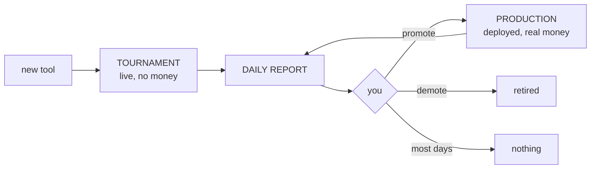

# Daily report — operator guide

The morning routine for the benchmark Slack report. Design of the wider system:
[PROPOSAL.md](PROPOSAL.md).

## 1. The loop



## 2. The report, message by message

| Message | Contains | You look at it when |
|---|---|---|
| **Title** | the verdict: 🟢 `PROMOTE n` · 🟠 `DEMOTE n` · 🔴 `NO ACTION` · ⚪ `NO CHANGE` | always — often the only thing you need |
| 1a. Production W-2 vs W-1 | week-over-week movement | a delta surprised you |
| 1b. Production 90D vs W-1 | the decision table: `floor`, `condAcc`, `rec` | title said act, or you want the evidence |
| 2. Tournament | candidates, same columns | title said PROMOTE |
| 3. Alerts | reasons to distrust today's numbers | **before acting on anything** |
| 4. Simulated trader ROI | context only — never a decision input | curiosity |

🔴 `NO ACTION` = every deployed tool fails but demoting all would empty the platform → escalate, never act tool-by-tool.

## 3. The two gates

> **PROMOTE** a tournament tool: **n ≥ 30** and **`floor` > +0.04** and **`condAcc` ≥ 50%**.

> **DEMOTE** a production tool: **n ≥ 30**, fails that floor, and **either** `condAcc` < 50% **or** Brier above its own `base` by ≥ 0.01 in **both** the 90d window and the last week — **unless** it would empty the platform.

Low reliability (`rel` < 80%) never decides — it annotates: `PROMOTE (rel 60%)`.

## 4. Every possible `rec` value

| `rec` says | Meaning | You do |
|---|---|---|
| `PROMOTE` | candidate passed all three gate tests | start the promote flow (§5) |
| `review: floor ok, condAcc NN%` | bound cleared but loses its disagreements — scores by agreeing with the market | look, do **not** promote |
| `no: +0.0XX short` | bound missed the +0.04 margin by that much | nothing; watch it |
| `no: condAcc NN%` | candidate loses the markets it disagrees on | nothing |
| `no: no-skill` | candidate worse than always guessing the base rate | nothing |
| `keep` | deployed tool, no demote signal | nothing |
| `keep (floor ok)` | deployed tool that would even pass the promote bar | nothing |
| `keep (floor ok, condAcc NN%)` | passes the bar but condAcc dipped below 50% | keep an eye on it |
| `demote: condAcc NN%` | deployed tool loses its disagreements | start the demote flow (§5) |
| `demote: no-skill` | worse than its own base rate, in both windows | demote flow (§5) |
| `n=X < 30` | too few scored markets to judge | nothing — *not enough data ≠ no improvement* |
| `no data` | nothing scored in the window | nothing; check collection if persistent |
| `no spread` | edge exists but no variance recorded (n < 2) | nothing |
| `needs --rebuild` | scores file predates the spread field — migration state, not a data state | wait for the nightly rebuild; flag if it persists |
| any of the above + `(rel NN%)` | verdict stands, but the tool answered only NN% of calls | check why it misses calls before acting |

Under 1b, `⚠ NO REPLACEMENT` = all deployed tools demote and nothing can replace them (→ 🔴). `⚠ NO DEPLOYED REPLACEMENT — … clears the promote gate in the tournament` = promote **before** retiring.

A `PROMOTE` is a **nomination**: statistics passed. Deployment still takes ablation + human review + canary ([PROPOSAL.md](PROPOSAL.md) Part 10). Promoting **adds**; it never replaces.

## 5. Which repository

| Action | Where |
|---|---|
| **Deploy** | 1. `mech-predict`: add tool to the service, merge, cut a release. 2. `agent-deployments`: add to `TOOLS_TO_PACKAGE_HASH`, update `METADATA_HASH`, bump `PROPEL_SERVICE_HASH_ID`. **This order** — CI rejects a tool not in the released service |
| **Demote** | `agent-deployments` only: remove from `TOOLS_TO_PACKAGE_HASH`, update `METADATA_HASH` |
| **New candidate** | `mech-predict` only: add to `benchmark/tournament_tools.json` |

**If in doubt, do nothing.** A missed promotion costs a day; a wrong demotion costs a working tool.

## Appendix — why these metrics

**Why not accuracy?** The trader bets bigger when a tool sounds more confident, so a tool can pick the right side 70% of the time and still lose money by being overconfident on the wrong 30%. Tools are graded on beating the **price** (`Edge`), guarded against confident-wrong and against hedging to 50/50.

**`floor` — what the promote test actually reads:**

```
floor  =  Edge  −  1.645 × ( spread ÷ √markets )
```

A textbook **one-sided 95% confidence lower bound on a mean** — the worst true Edge the evidence still supports:

| Piece | Meaning |
|---|---|
| `Edge` | the average of the per-market edge numbers |
| `spread ÷ √markets` | the **standard error**: how much that average would wobble on a re-drawn sample. The √ is why evidence compounds — halving the deduction takes 4× the markets |
| `1.645` | the normal-curve point with 5% below it — the one-sided 95% multiplier |

It claims: *if the per-market edges are independent, there is ≤5% chance the tool's true long-run Edge is below this number.* One-sided on purpose: a false promote loses money, a missed one costs a day.

Known gaps, absorbed by the +0.04 margin: markets are not fully independent (ladder markets resolve off one event, so the deduction runs small), small samples would want Student-t rather than 1.645, and the test re-runs daily, so 95% is per-day, not per-decision.

Two real tools, same report:

| tool | Edge | markets | deduction | floor |
|---|---:|---:|---:|---:|
| `factual_research` | −0.0256 | 6,938 | 0.005 | −0.0308 |
| `superforcaster-polymarket-v2` | −0.1551 | 31 | **0.113** | −0.2680 |

Same spread, **22× the deduction** — a great average off 31 lucky markets does not clear the gate.

**The other gate inputs:** `condAcc` = win rate on the only markets a bet is placed on (where the tool disagrees with the price) — under 50% is a coin flip with costs. `n ≥ 30` = below it, "not enough data yet" is the honest answer. `base` = the zero-skill reference; a demote needs the below-`base` signal in **both** windows because one window is noise. `rel` = warning only: the score is computed on the calls that came back, and blocking a tool for missed calls can leave a worse one deployed.
