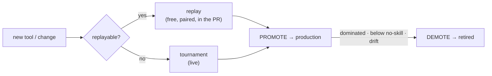

# Promote / Demote policy for prediction tools

Status: in progress on PR #341 — the first slice ships here; the rest continues on later commits. The **Checkpoints** section is temporary (delete when the policy is complete); the rest stays as the reference design.
Touches: `benchmark/analyze.py`, `tool_lineage.json`, replay + tournament config.

## Goal

Per platform, the daily report tells a human two things, **advisory** (a human still opens the deploy PR):

- **Promote** — a candidate is good enough to deploy.
- **Demote** — a deployed tool should be retired.

A tool is judged on **edge** (does it beat the market?), not raw direction (see Metric), and only **against other versions of itself** (its family, `tool_lineage.json`).

## Terms

| Term | Means |
|---|---|
| **Brier** | squared error of the predicted probability vs the 0/1 outcome; lower = better |
| **Log-loss** | like Brier, but punishes a confident-**and**-wrong prediction far harder |
| **Calibration** | do the stated probabilities match reality? (of all "70%" calls, ~70% happen); overconfident = poorly calibrated |
| **Edge / skill-vs-market** | how much the tool beats the market-implied probability — the part you can actually bet on |
| **Sharpness** | how decisive a tool is — how far from 0.5 its probabilities dare to go. Collapsing toward 0.5 = hedging (better Brier, but no edge) |
| **No-skill** | the score of a trivial predictor (the market price / base rate); below it = worse than not betting |
| **Accuracy / win-rate** | fraction of directionally-right calls; ignores confidence |
| **Family / lineage** | a base tool and its versioned descendants (`tool_lineage.json`) |
| **Replayable** | the change only affects how a tool **reasons over given evidence** (prompt, parsing, model swap) → it can be re-scored on **recorded** requests + their saved evidence. **Not** replayable: a brand-new tool, or a change to how it **gathers** evidence (search / retrieval) |
| **Relevant set** | the deployed tools of a family worth keeping — those not significantly worse than the best, and above no-skill |

## Metric — measure edge, not direction

The goal is **trader profit**. The trader Kelly-sizes bets off the tool's probability, so **calibration / edge** is what pays, not raw direction — a tool can win 70% of its calls yet lose money if it's overconfident (Kelly over-bets the ones it's confidently wrong about).

| Measure | Use here |
|---|---|
| **Accuracy / win-rate** | ❌ the trader's routing signal; read only as a demote cross-check |
| **Realized PnL** | ❌ too noisy / confounded to grade a tool by |
| **Brier vs the market** (edge) | 🟢 **primary gate** — edge is what pays |
| **Log-loss** | 🟢 **guard** against the confident-wrong disaster |

### Comparing two tools — the algorithm

Both tools are scored on the **same dataset** — a collection of predictions (replay reuses the incumbent's recorded deliveries; the tournament runs both on the same market list). **Treat the dataset as a whole — don't group by market** (a market may appear once, many times, or not at all). Over the whole set, compute for each tool:

- **edge** — its Brier skill vs the market price (the gate — what you bet on);
- **log-loss** — the confident-wrong guard;
- **sharpness** — how far from 0.5 its probabilities dare to go (the anti-hedging guard).

**B beats A** only when **all** hold:

1. **Edge margin** — B's edge beats A's by more than the noise floor.
2. **Significant** — the gap holds (confidence interval excludes 0, or holds on two time windows) — not a one-off.
3. **Log-loss guard** — B's log-loss is not worse.
4. **Sharpness guard** — B didn't just **hedge toward 0.5** (sharpness not materially below A's) — this is what catches a "better Brier" that's really timidity, not skill.
5. **Enough data** — `n` above the floor; else the verdict is "not enough data yet" (show `n` + the smallest gap the data could prove).

Else → **A wins** or **tie**. Comparing against *no tool* (a new family, or the demote floor) → A's edge is 0, so B must beat the **market**.

Why this shape: the **same dataset** removes the difficulty confound; **edge** (not raw Brier) is what pays; **log-loss** catches the confident-wrong disaster; **sharpness** catches the hollow "better Brier by hedging" case; **significance** stops us promoting noise.

## Lifecycle

| Mode | Scores | Role |
|---|---|---|
| **Replay** | candidate re-run on **recorded** requests + saved evidence | PR merge gate **and** the promote test for **replayable** changes (free + paired) |
| **Tournament** | tools run **live** on a shared set of open markets | the promote test for **non-replayable** changes / new tools |
| **Production** | deployed tools' real answers vs outcomes | demote / roster |

## Promote

Route by **replayable?**:

- **Replayable → replay (default).** Re-run the candidate on the incumbent's **recorded requests + saved evidence**. Free, **paired by construction**, runs in the PR/CI — most version bumps land here, **no tournament needed**. Decide with the two-tool algorithm (candidate vs incumbent).
- **Not replayable → tournament.** A brand-new tool, or a change to how it gathers evidence, can't be faithfully replayed (replay feeds the old evidence). Run it **live in the tournament** on a shared market set, then the same algorithm.

**New family (no incumbent).** A brand-new tool is non-replayable and has nothing in its family to beat → tournament. The bar becomes **edge over the market** (the algorithm vs the market baseline), significant + enough data, **plus a human sign-off** — a new approach is a bigger call than a version bump.

Incumbent = the **best-scoring deployed version** of the family.

## Demote — keep the relevant set

Keep the **relevant set** of a family, **not a single champion**: the traders' explore/exploit converges to the best deployed tools on its own, so a small competitive cluster is healthy and lets them adapt. Prune only what isn't relevant:

| Path | Demote when |
|---|---|
| **Dominated** | a deployed sibling beats it by the two-tool margin (significantly worse than the best) |
| **Below no-skill** | negative edge vs the market — worthless to bet |
| **Drift** | a deployed tool worse than its own past baseline, sustained |

Keep everything **within noise of the best** sibling — it's relevant; let the traders sort it out. The best of a family is **never** demoted (so it can't collapse to "retire everything").

**Lone tool gone bad.** A family's only tool has no sibling, so judge it on **drift** or **below no-skill**. Every lone-tool demote carries a **replacement warning** (checks production **and** tournament):

| Replacement | Warning |
|---|---|
| none deployed, none in tournament | ⚠️ no replacement anywhere — retiring leaves this market type unserved |
| none deployed, candidate in tournament | ⚠️ no deployed replacement, but `<candidate>` is under evaluation — consider fast-tracking it |

## Reality check

- Proving a small edge needs **hundreds** of paired markets; we usually get tens → promotions are **rare by design**.
- Bias toward "wait for more data" — a false promote is the dangerous failure.
- Label non-fires **"not enough data yet,"** not "no improvement."

## Known dependencies

- **Replayability flag** — we must know, per change, whether it's replayable (reasoning-only) or not (new tool / evidence change) to route promote → replay vs tournament.
- **Lineage ledger** — `factual_research-v3` is missing from `tool_lineage.json` → resolves as a singleton; add it.
- **Outcome join** — replay/production Brier needs each answer matched to its resolved outcome (the subgraph has no outcome field → title / market-id match). **Drop unmatched rows, don't guess.**

## Checkpoints — PR status (temporary; delete when the policy is complete)

### Done on this PR (#341)

- [x] Lineage scoping; per-platform advisory `## Promotion / Demotion` section in report + Slack
- [x] Promote rule (Brier `≥ 0.04` + log-loss + `valid_n ≥ 30`); demote (superseded + sibling-domination)
- [x] Tests + review fixes (per-incumbent dedup, deterministic ordering, degraded-load logging)

### Pending (subsequent commits)

- [ ] **Edge-vs-market** as the metric (replace the raw Brier delta with skill-vs-market)
- [ ] **Two-tool algorithm** (whole-set edge + significance + log-loss & sharpness guards + `n` labelling)
- [ ] **Replay-as-promote** for replayable changes; **tournament** route for non-replayable ones
- [ ] **New-family promote** (edge-vs-market + human sign-off)
- [ ] **Relevant-set demote** (prune dominated + below-no-skill; keep the cluster) + lone-tool drift / replacement warning
- [ ] Lineage-ledger fix; outcome join

### Deferred

- [ ] Resampling confidence intervals / sequential tests — revisit when per-tool volume grows
