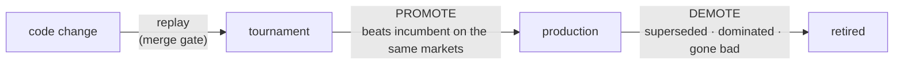

# Promote / Demote policy for prediction tools

Status: in progress on PR #341 — the first slice ships here; the remaining items continue on subsequent commits to this PR. The **Checkpoints** section is temporary and gets deleted once the policy is fully implemented; the rest of the document stays as the reference design.
Touches: `benchmark/analyze.py`, `tool_lineage.json`, tournament config.

## Goal

The daily benchmark report should tell a human, **per platform**, two things:

- **Promote** — a candidate tool has proven good enough to deploy.
- **Demote** — a deployed tool should be retired.

Both are **advisory**: the report flags them, a human still opens the deploy PR. A tool is judged only **against other versions of itself** (its _family_, tracked in `tool_lineage.json`), never against an absolute "good enough" bar — with one exception (a lone tool below no-skill; see Demote). That keeps the rule safe: the best version of a family can never be demoted, so it can't collapse into "retire everything."

## Terms

| Term | Means |
|---|---|
| **Brier** | squared error of the predicted probability vs the 0/1 outcome; lower = better |
| **Log-loss** | like Brier, but punishes a confident-**and**-wrong prediction far harder |
| **Calibration** | do the stated probabilities match reality? (of all "70%" calls, ~70% happen). Overconfident = poorly calibrated |
| **Edge / skill-vs-market** | how much the tool beats the **market-implied** probability — the part you can actually bet on |
| **No-skill baseline** | the score a trivial predictor gets (e.g. always the base rate, or the market price); below it = worse than not trying |
| **Accuracy / win-rate** | fraction of calls that are directionally right; ignores confidence |
| **Kelly** | bet-sizing rule — stake grows with your edge to maximize long-run (log-)wealth; needs honest probabilities |
| **Family / lineage** | a base tool and its versioned descendants (`tool_lineage.json`), e.g. `factual_research → -v1 → -v2` |
| **Incumbent** | the best-scoring **deployed** version of a family — what a candidate must beat |
| **Paired** | candidate and incumbent scored on the **same** markets, so a gap means skill, not luck |
| **Drift** | a deployed tool getting worse over time vs its own past baseline |

## Metric — measure edge, not direction

The real goal is **trader profit**. The trader sizes bets with **Kelly off the tool's probability**, so what pays is **calibration and edge**, not raw direction — a tool can win 70% of its calls yet lose money if it's overconfident (Kelly over-bets the ones it's confidently wrong about).

| Measure | Captures | Use here |
|---|---|---|
| **Accuracy / win-rate** | direction only — ignores confidence, so ignores bet sizing | ❌ it's the **trader's** routing signal; read only as a demote cross-check |
| **Realized PnL** | the true objective | ❌ too noisy / confounded to grade a tool by |
| **Brier vs the market** (edge) | calibration **and** beating the price you'd bet against | 🟢 **primary gate** — edge is what pays |
| **Log-loss** | calibration, harshest on confident-wrong | 🟢 **guard** — closest to the Kelly (log-wealth) objective |

**One line:** measure calibration / edge (Brier-vs-market + log-loss guard), not direction — Kelly bets the probability, not the call.

## Lifecycle

| Mode | Scores | Decides |
|---|---|---|
| **Replay** | code re-run on recorded prompts vs baseline | PR merge gate |
| **Tournament** | candidates on live open markets, scored on resolution | **promote** |
| **Production** | deployed tools' real on-chain answers vs outcomes | **demote** |



Promote reads **tournament** data (a candidate has no production history yet); demote reads **production** data.

## The policy

_Target design. Where the current PR already implements a piece, the **Checkpoints** section says so._

### Promote (tournament → production)

A candidate is promoted when, within its family and on one platform, **all** hold:

1. **Paired** — candidate and the deployed tool are scored on the **same** markets, so a gap means skill, not which markets each happened to face (how we get the same markets is below).
2. **Real margin** — Brier better by a threshold **above the noise floor**, and the win **holds on two separate time windows** (cheap guard against a one-off fluke).
3. **Log-loss agrees** — not worse.
4. **Enough data** — sample size shown on every verdict; a non-fire reads as "not enough data yet," not "no improvement."

Incumbent = the **best-scoring deployed version** of the family.

**Making the comparison fair.** Production can't give us this comparison: the candidate isn't deployed, so it has **no production data** to pair against. And production wouldn't be a fair test anyway — each trader picks its markets and its tool **randomly and independently**, so which tool answered which market is just noise, not a matched comparison. So we run both tools on the same markets ourselves, two ways:

- **In the tournament** — also run the deployed tool on the tournament's markets, so it answers the **same** ones as the candidate, live. Draw those markets from the pool the traders actually bet on, so the result carries over to production. (Costs extra live runs of the deployed tool.)
- **By replay** — re-run the candidate on the deployed tool's **recorded past requests** (same markets, same saved evidence). Cheaper and exact, but it can't see a change to how a tool **gathers evidence** (the candidate reuses the old evidence).

Rule of thumb: a **prompt / reasoning** change → replay is enough; an **evidence / search** change → use the tournament.

### Demote (production → retire)

Any one of three paths fires a demote:

| Path | Fires when |
|---|---|
| **Superseded** | a candidate just got promoted over this version |
| **Sibling-dominated** | another deployed version of the family scores meaningfully better |
| **Lone tool gone bad** | the only version of its family **drifts** below its own past baseline, or falls **below no-skill** (worse than guessing the base rate) |

A lone tool that's only _mildly_ bad stays deployed and gets an **improvement** issue instead — retiring your only tool leaves a gap. But a lone tool **below no-skill** is actively harmful, so it's surfaced for retirement, always with a **replacement-status warning**:

| Replacement | Warning |
|---|---|
| none deployed **and** none in tournament | ⚠️ no replacement anywhere — retiring leaves this market type unserved |
| none deployed, **candidate in tournament** | ⚠️ no deployed replacement, but `<candidate>` is under evaluation — consider fast-tracking it |

```text
🔴 DEMOTE  factual_research v0.17.0 — Brier 0.30 (n=150), worse than no-skill
   (skill -0.08), up from its own 0.21 baseline.
   ⚠️ no replacement deployed or in tournament — retiring leaves this unserved.
```

### Handling thin data (cuts across both)

We rarely have enough resolved markets to prove a small win:

- A `0.02` Brier win needs **hundreds** of paired markets; we usually have tens.
- So promotions are **rare by design**, and the bar errs toward "wait for more data" — a false promote is the dangerous failure.
- Every verdict shows its `n` and the smallest win the data could prove, so "no signal yet" is distinguishable from "genuinely no better."
- Heavier statistics (resampling confidence intervals, sequential tests) are **deferred** until per-tool volume justifies them.

### Per-platform, always

Omen and Polymarket are scored **separately** — different baseline difficulty, so they're never averaged together.

## Known dependencies

- **Lineage ledger** — `factual_research-v3` is missing from `tool_lineage.json` → resolves as a singleton; add it or it can't be compared to its family.
- **Outcome join** — production Brier needs each live answer matched to its market's resolved outcome (the subgraph has no outcome field → title / market-id match). **Drop unmatched rows, don't guess** — a bad join is a false demote.
- **Cold start** — a brand-new tool has no baseline / no paired history → not eligible until it accrues a minimum `n`.

## Checkpoints — PR status (temporary; delete when the policy is complete)

### Done on this PR (#341)

- [x] Lineage scoping — family resolution via `tool_lineage.json`, best deployed member = incumbent
- [x] Per-platform, advisory `## Promotion / Demotion` section in the daily report + Slack
- [x] Promote: tournament candidate beats deployed incumbent by Brier `≥ 0.04` (`PROMOTE_MIN_DELTA`), log-loss not worse, both `valid_n ≥ 30` (`PROMOTE_MIN_N`)
- [x] Demote: superseded + sibling-domination paths
- [x] Tests + review fixes (per-incumbent dedup, deterministic ordering, degraded-load logging)

### Pending (subsequent commits on this PR)

- [ ] **Pairing** — run the deployed incumbent in the tournament so promote compares on the same markets
- [ ] **Two-window agreement** + show `n` and smallest-provable-win on every verdict
- [ ] **Lone-tool demote** — drift + below-no-skill triggers, with the replacement-status warning
- [ ] **Lineage ledger** — add `factual_research-v3`
- [ ] **Outcome join** for production-side Brier (drop unmatched rows)

### Deferred (not this PR)

- [ ] Resampling confidence intervals / sequential tests — revisit when per-tool volume grows
