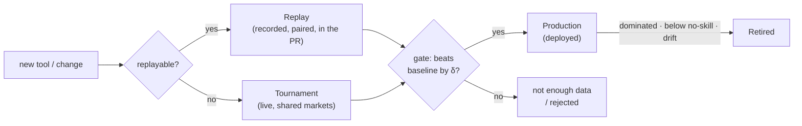

# Promote / Demote policy for prediction tools

Status: in progress on PR #341 — the first slice ships here; the rest continues on later commits. The **Checkpoints** section is temporary (delete when the policy is complete); the rest stays as the reference design.
Touches: `benchmark/analyze.py`, `tool_lineage.json`, replay + tournament config.

## Goal

Per platform, two **advisory** calls reach a human (who still opens the deploy PR) — surfaced in the PR `/benchmark` and the daily-report rosters:

- **Promote** — a candidate is good enough to deploy.
- **Demote** — a deployed tool should be retired.

A tool is judged on **edge** (does it beat the market?), not raw direction (see Metrics), and only **against other versions of itself** (its family, `tool_lineage.json`).

## Metrics

The whole point is for the trading bot to make money. The bot bets bigger when a tool sounds more confident, so a tool's job isn't just to pick the right side ("yes" or "no") — it's to give honest odds that beat the market's price. *Honest odds* mean that things a tool calls "70% likely" really happen about 70% of the time. A tool can pick the right side 70% of the time and still lose money if it sounds too sure on the ones it gets wrong — the bot bets big on those and loses big. So we grade tools on how well they beat the market (we call this **edge**), and we guard against two ways a score can look better than it really is: being confident and wrong, and playing it safe by always guessing near 50/50.

**Notation** — per prediction: `p` = tool's probability of "yes", `m` = market price, `o` = outcome (`1`/`0`); `mean(…)` averages over the `N` predictions. Inputs = a recorded delivery joined to its resolution; **drop rows that don't join — don't guess.**

| Metric | Formula (what it means) | Role |
|---|---|---|
| **Brier** | `mean( (p − o)² )` — squared error; `0` perfect, `0.25` = always-50/50, `1` = confident-wrong | building block |
| **Log-loss** | `mean( −[o·ln p + (1−o)·ln(1−p)] )` — punishes confident-wrong far harder (→ ∞) | 🟢 guard |
| **Skill vs market** = **edge** | `mean((m−o)²) − mean((p−o)²)` — market's Brier minus tool's; `> 0` beats the price | 🟢 **edge** — the gate input (see *The gate*); also the no-skill **floor** |
| **Sharpness** | `mean( abs(p − 0.5) )` — decisiveness; near `0` = hedging to 50/50 | 🟢 guard |
| **Accuracy** | `mean( 1 if round(p) = o )` — right side only, ignores confidence | ❌ routing only |
| **PnL** | realized returns — too noisy to grade a tool | ❌ |

**Brier (not log-loss) is the headline rule** (robust); **log-loss skill** (same formula with log-loss) ≈ the actual **Kelly profit** but tail-sensitive → a guard / tie-breaker, not the headline.

**Worked example** (Brier skill, 3 predictions):

| market | `m` | `p` | `o` | `(p−o)²` | `(m−o)²` |
|---|---|---|---|---|---|
| A | 0.60 | 0.80 | 1 | 0.040 | 0.160 |
| B | 0.50 | 0.30 | 0 | 0.090 | 0.250 |
| C | 0.70 | 0.65 | 1 | 0.1225 | 0.090 |

`BS_tool = 0.084`, `BS_market = 0.167` → **Brier skill = +0.083** (tool beats the price) → clears **δ = 0.04**, so promote-worthy **if** it's also significant and `n ≥ 30`.

### The gate

**One rule.** Form the **paired** per-prediction differences `dᵢ = BS_baselineᵢ − BS_candidateᵢ` (same market + outcome, so difficulty cancels — when the baseline is the market, this is the **edge** from the table above). **Promote** when a one-sided paired test clears the margin — **H₀** `mean(d) ≤ δ` vs **H₁** `mean(d) > δ` — i.e. the lower end of the **95% bootstrap CI** on `mean(d)` exceeds **δ = 0.04** Brier, with **`n ≥ 30`**, and the guards hold (**log-loss not worse**, **sharpness not collapsed**). One-sided + conservative by design: a false promote (Type I) loses money; a missed upgrade (Type II) just keeps the incumbent. Below `n`, or a CI that can't clear `δ` → **"not enough data yet"** (report the minimum detectable effect `≈ (z_α + z_β)·sd(d)/√n`, never "no improvement").

**How much data is enough?** `n ≥ 30` is a **floor**, not a green light — at `n = 30` the bootstrap CI is far too wide to clear `δ = 0.04`. Solving the gate for `n` (`n ≈ ((z_α + z_β)·sd(d) / δ)²`, with `sd(d) ≈ 0.2`, one-sided, 80% power) gives roughly **~125 paired markets for `δ = 0.05`, ~200 for `δ = 0.04`, ~780 for `δ = 0.02`**. **Replay** reaches these immediately (the recorded set is large, so `n` rarely binds); **tournament** accrues ~30 resolved markets/day, so a `δ = 0.04` call needs **~1 week+** (markets must resolve first). When `n` falls short, report the minimum detectable effect rather than "no improvement".

The **only** thing that changes between cases is the baseline:

| Case | Baseline `d` compares against | Extra |
|---|---|---|
| **Q1 — has a sibling** (same markets, via replay or tournament) | the **best sibling**'s Brier (the incumbent) — `BS_sibling − BS_candidate` (market term cancels) | — |
| **Q2 — no sibling** (new tool / new family) | the **market**'s Brier — `BS_market − BS_candidate` | **+ human sign-off** |

Treat the dataset as a **whole** — don't group by market.

## Lifecycle

| Mode | Scores |
|---|---|
| **Replay** | candidate re-run on **recorded** requests + saved evidence |
| **Tournament** | tools run **live** on a shared set of open markets |
| **Production** | deployed tools' real answers vs outcomes |

## Promote

A PR's tool is judged when it opens; the route depends on whether it can be **replayed**.

**Path A — improves a deployed tool (replayable).**

1. **Human / triage** — files an issue describing the fix.
2. **Agent** — opens a PR with the child tool, calls `/benchmark`.
3. **Benchmark (CI)** — replays candidate vs its **incumbent** (best deployed sibling) on recorded deliveries; appends a **promote recommendation + justification** (the gate: edge vs `δ`, significance, `n`) under the report.
4. **Human** — reviews; if promoted, **adds** it to the deployed set — does **not** replace (keep several live so traders converge).

**Path B — brand-new tool (not replayable, no incumbent).**

1. **Agent / human** — opens a PR with the new tool. No parent in `tool_lineage.json` → replay can't run → flagged **"new family → tournament"** (no `/benchmark`).
2. **Tournament** — runs it live on shared markets vs the **market** baseline (Q2).
3. **Human** — signs off on the tournament gate (edge over market, significant, `n`) → **adds** to the deployed set.

The benchmark's promote line is a **hint** — it sees only candidate vs the baseline it ran, not full deployment state; the **human** makes the deploy call.

### Tournament roster (in the daily report)

Path B tools mature in the tournament, so the daily report lists each one — one row, human-scannable — for the promote call:

| Tool | Family | In tournament | Markets `n` | Edge vs market | Significant? | Rec |
|---|---|---|---|---|---|---|
| `tool-v4` | `tool` | 6 d | 142 | +0.03 | no (CI incl. 0) | wait |
| `other-v2` | `other` | 12 d | 310 | +0.06 | 🟢 yes | **promote** |

Thresholds as in *The gate* (`δ = 0.04`, `n ≥ 30`); **Rec = promote** only when edge clears `δ`, is significant, and the guards hold.

## Demote — keep the relevant set (cap `N = 3` per family)

Keep a small **relevant set** per family — the best tool **plus** any sibling still competitive — **not** a single champion (traders' explore/exploit converges on the best, so a competitive cluster helps them adapt) and **not** an unbounded pile. A deployed tool **stays** only if **all** keep-conditions hold; else demote. The family's best is **never** demoted by the *relative* rules (sibling-domination / over-cap) — but it is **still demoted on absolute failure** (sustained drift, or persistently below the no-skill bar), via the lone-tool path below, with a replacement warning. So a family that is far worse than the rest on absolute terms is not shielded.

| Keep when | Demote when |
|---|---|
| within noise of the best sibling | **Dominated** — a sibling beats it by the gate margin |
| edge `> 0` vs the market | **Below no-skill** — edge `< 0`, worthless to bet |
| no sustained drift | **Drift** — worse than its own past baseline, sustained |
| in the top `N` by edge | **Over cap** — `N` better siblings already kept → prune the weakest |

So a family keeps **1** tool when no sibling is competitive, up to **`N`** when several are — never more.

**Lone tool gone bad.** A family's only tool has no sibling → judge on **drift** / **below no-skill** only. Every lone-tool demote carries a **replacement warning** (checks production **and** tournament):

| Replacement | Warning |
|---|---|
| none anywhere | ⚠️ retiring leaves **no deployed tool for this family** |
| candidate in tournament | ⚠️ no deployed replacement, but `<candidate>` is under evaluation — consider fast-tracking |

### Production roster (in the daily report)

The report lists every deployed tool, grouped by family, so a human sees the keep/demote picture at a glance:

| Tool | Family | Markets `n` | Edge vs market | Drift | Rec |
|---|---|---|---|---|---|
| `tool-v3` | `tool` | 540 | +0.07 | no | keep (best) |
| `tool-v2` | `tool` | 480 | +0.05 | no | keep (within noise) |
| `tool-v1` | `tool` | 610 | +0.01 | no | **demote** (dominated) |
| `other-v1` | `other` | 300 | −0.02 | — | **demote** (below no-skill) ⚠️ no replacement |

Same thresholds as *The gate*; **Rec = demote** only on a sustained signal, never a one-off.

## Checkpoints — PR status (temporary; delete when the policy is complete)

### Done on this PR (#341)

- [x] Lineage scoping; per-platform advisory `## Promotion / Demotion` section in report + Slack
- [x] Promote rule (Brier `≥ 0.04` + log-loss + `valid_n ≥ 30`); demote (superseded + sibling-domination)
- [x] Tests + review fixes (per-incumbent dedup, deterministic ordering, degraded-load logging)

### Pending (subsequent commits)

- [ ] **Edge-vs-market** as the metric (replace the raw Brier delta with skill-vs-market)
- [ ] **The gate** (paired one-sided test: whole-set edge + significance + log-loss & sharpness guards + `n` labelling)
- [ ] **Replay-as-promote** for replayable changes; **tournament** route for non-replayable ones
- [ ] **Conditional promote hint in the PR `/benchmark` replay** (states numbers + conditions, defers to the daily report)
- [ ] **New-family promote** (edge-vs-market + human sign-off)
- [ ] **Relevant-set demote** (prune dominated + below-no-skill; keep the cluster) + lone-tool drift / replacement warning
- [ ] Lineage-ledger fix (`factual_research-v3` missing → singleton) + outcome join (title/market-id match; **drop unmatched**)
- [ ] Per-change **replayability flag** (routes replay vs tournament); confirm **tournament volume** (~30/day → time-to-`n ≥ 30`)

### Deferred

- [ ] Resampling confidence intervals / sequential tests — revisit when per-tool volume grows

## Appendix — Terms

- **Brier**: squared error of the predicted probability vs the 0/1 outcome; lower = better.
- **Log-loss**: like Brier, but punishes a confident-**and**-wrong prediction far harder.
- **Calibration**: do the stated probabilities match reality? (of all "70%" calls, ~70% happen); overconfident = poorly calibrated.
- **Edge / skill-vs-market**: how much the tool beats the market-implied probability — the part you can actually bet on.
- **Sharpness**: how decisive a tool is — how far from 0.5 its probabilities dare to go; collapsing toward 0.5 = hedging (better Brier, but no edge).
- **No-skill**: the score of a trivial predictor (the market price / base rate); below it = worse than not betting.
- **Accuracy / win-rate**: fraction of directionally-right calls; ignores confidence.
- **Family / lineage**: a base tool and its versioned descendants (`tool_lineage.json`).
- **Incumbent**: the best deployed version of a family — the baseline a candidate must beat (the "best sibling").
- **Replayable**: the change only affects how a tool **reasons over given evidence** (prompt, parsing, model swap) → it can be re-scored on **recorded** requests + their saved evidence. **Not** replayable: a brand-new tool, or a change to how it **gathers** evidence (search / retrieval).
- **Relevant set**: the deployed tools of a family worth keeping — those not significantly worse than the best, and above no-skill, capped at `N` per family.
