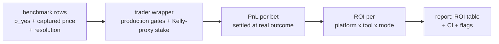

# Trader-ROI Companion Simulation - One-Pager

**Question:** does a better prediction tool improve a trader agent's realized ROI - not just its Brier score?
**Answer method:** replay every tool's stored predictions through the production trader's own decision rules, at the captured market price, and settle with the known resolution.

## Where it runs

| | |
|---|---|
| Repository | **mech-predict** (same repo as the accuracy benchmark) |
| Trigger | **new standalone workflow** `benchmark_roi.yaml` (daily cron after the flywheel + manual dispatch) - the existing flywheel and replay workflows are **not modified** |
| Inputs | the flywheel's own persisted CI artifacts (`benchmark-data` production shards + `tournament-predictions` scored rows) - **no new capture, no LLM calls, no secrets** |
| Output | `benchmark/results/report_roi_{omen,polymarket}.md` + machine-readable `roi_results.json`, uploaded as a `benchmark-roi` artifact |
| Modes covered | **production** (deliveries from live traders; price/spread/liquidity captured natively) **and tournament** (CI predictions; price captured, no spread -> that gate self-skips) |



## How the simulated trader works

One frozen trader config per platform - the strategy defaults the live traders run, identical for every tool. Per prediction (all inputs are prediction-time snapshots; nothing future-observable enters a gate):

```
tool says p_yes = 0.62, market price = 0.54  ->  bet the favored side (p_side >= 0.5)
  -> edge 0.08 passes the platform's gates     [Omen: edge > 0.03, no cap; Polymarket: 0.01 < edge < 0.30, spread <= 0.10]
  -> Kelly-proxy stake  f = edge/(1-price), capped at 2.5 USDC on a 100 USDC nominal bankroll
  -> market resolves YES -> PnL = stake * (1/price - 1)
ROI = total PnL / total staked  over ALL its bets (capital-weighted; skips count too: no bet = no stake)
```

Costs are platform-native and reported as a second variant of the same bet set: Omen +0.02 on the buy price (AMM-fee proxy), Polymarket +0.08 (half-spread proxy). The method is the certified simulation contract already cross-validated against the live traders' own ledgers (independent re-implementation triangulated to exact agreement; market-clustered bootstrap CIs with fixed seeds).

Each daily run re-reads the accumulated artifacts and recomputes a **trailing window (default 90 days, on prediction date)** so the report answers:
> *"A trader using tool X for the last 90 days would have earned ROI x.x% (95% CI) on n bets."*

**Idempotent and reconstructible by design:** the report is a pure function of the input artifacts (fixed bootstrap seeds, no wall-clock dependence beyond the window cutoff date) - re-running on the same day with the same artifacts reproduces the report byte-for-byte.

## Example output (ILLUSTRATIVE numbers)

**Simulated trader ROI - trailing 90 days - Polymarket**
ROI = total PnL / total staked on bets placed *in this window* (not all-time, not annualized).

| Tool | mode | n preds | n bets | Brier (all -> bets) | staked | ROI (95% CI) | ROI w/ costs | flags |
|---|---|---|---|---|---|---|---|---|
| fine-tuned tool | tourn | 1,240 | 96 | 0.21 -> 0.26 | 212 USDC | **-2.9%** (-10.1, +4.6) | -5.1% | |
| live production tool | prod | 3,410 | 187 | 0.24 -> 0.33 | 421 USDC | -6.3% (-11.2, -1.5) | -8.8% | |
| tournament-only tool | tourn | 310 | 22 | 0.25 -> 0.31 | 48 USDC | -1.0% (-19.4, +18.2) | -3.2% | few bets - anecdotal |

Brier/accuracy = over ALL eligible predictions (same basis as the accuracy benchmark); the Brier
worsening from all -> placed bets shows the gate selecting the tool's weaker forecasts.
Rows below the sample threshold are **shown and flagged, never dropped**; likewise every prediction
tool is always shown (zero-eligible ones flagged "no eligible rows in window"), non-prediction tools
(no parseable prediction in any row) are summarized on one line below the table, and a
parse-reliability flag mirrors the accuracy benchmark's reliability gate (< 0.80).

**"vs baseline" paired comparison** (same markets, same trader, only the tool changes): deferred to a
second iteration - which tool anchors the comparison is TBD; the certified method already defines the
paired, both-bet-decomposed delta when it is switched on.

## Data sufficiency (measured, trailing 30 days of resolved predictions)

| segment | 30-day n | read |
|---|---|---|
| Omen production (top tools) | 5,400-11,500 | rich |
| Omen tournament (per tool) | 150-480 | adequate |
| Polymarket production (current deploys) | 340-1,770 | adequate |
| Polymarket production (new/legacy deploys) | 14-35 | thin - flagged |
| Polymarket tournament (per tool) | 43-104 | marginal - flagged |

The binding count is **bets, not predictions** (gates cut hard); the report shows both and flags
low-bet rows. A longer trailing window (90d) is the default remedy for thin segments.

## Slack visibility - staged, current pipeline untouched

| Phase | What | Existing pipeline touched? |
|---|---|---|
| 1 (ships first) | artifacts + committed-to-artifact reports only; `notify_slack` input **defaults to off** | no |
| 2 | the ROI workflow posts its **own** daily Slack message via the existing webhook + summarizer machinery | no |
| 3 (optional, later) | fold an ROI section into the main daily benchmark reports | yes - own PR, only after the numbers are trusted |

## Correctness - verified while building, then ONE pipeline ships

| Phase | Assurance |
|---|---|
| Development | port of an already-certified simulator (spec contract + independent re-implementation triangulated exactly + adversarial review); unit tests pin gate boundaries, settlement invariants, dedup, and CI determinism |
| Production | the **single certified pipeline** runs daily (no multi-route logic in CI); weak results quoted honestly as *"measured, not robust"* |

## Status

Design complete -> **implementation in progress** (standalone workflow + `benchmark/` module, demoed on a sandbox repo before the PR).
Known limits (disclosed): price-taker (no market impact), no order-book depth, tournament rows carry no spread (cost proxy only), hypothetical for tools no trader actually selects.
