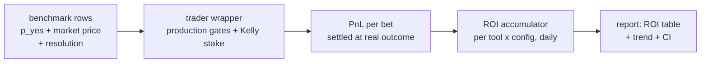

# Trader-ROI Companion Simulation - One-Pager

**Question:** does a better prediction tool improve a trader agent's realized ROI - not just its Brier score?
**Answer method:** replay every tool's predictions through the production trader's own decision rules, at the captured market price, and track the ROI over time.

## Where it runs

| | |
|---|---|
| Repository | **mech-predict** (same repo as the accuracy benchmark) |
| Trigger | new `roi-sim` job appended to the **daily benchmark flywheel** (GitHub Actions, 02:30 UTC) |
| Inputs | data the benchmark already stores (predictions + market price + resolutions) - **no new capture, no LLM calls, no secrets** |
| Output | accumulating `benchmark-roi` CI artifact + a short report |



## How the simulated trader works

One frozen trader config, identical for every tool. Per prediction:

```
tool says p_yes = 0.62, market price = 0.54
  -> edge 0.08 passes gates (edge band, spread cap)      [same values as production]
  -> Kelly proxy stakes 1.42 USDC (cap 2.5)
  -> market resolves YES -> PnL = +1.21 USDC
ROI = total PnL / total staked  over ALL its bets  (skips count too: no bet = no stake)
```

Each daily run scores the **newly resolved** markets and appends - so at any day D the report reads:
> *"A trader using tool X for the last 90 days would have earned ROI x.x% (95% CI) on n bets."*

...and the series shows how that number evolves week over week, per tool and per gate config.

## Example output (ILLUSTRATIVE numbers)

**Simulated trader ROI - trailing 90 days (2026-04-03 -> 2026-07-02) - Polymarket - production gate config**
ROI = total PnL / total staked on bets placed *in this window* (not all-time, not annualized).

**What "vs baseline" means:** the "baseline" is NOT a tool the fleet designates - live
traders pick tools per-request (epsilon-greedy). It is the comparison anchor of this
measurement: a reference tool run through the exact same simulation. **Which tool serves as
the baseline is TBD.** To compare: take only the markets BOTH tools predicted, run the same
simulated trader once with each, and subtract the two ROIs. Same markets, same trader, same
period - only the tool changed, so the difference is the tool's added value.

> Toy example: markets A and B were predicted by both tools.
> Trader using tool X: stakes 4 USDC total, gets back 4.40 -> ROI **+10%**.
> Trader using the baseline: stakes 4 USDC total, gets back 3.80 -> ROI **-5%**.
> vs baseline = +10% - (-5%) = **+15 pp**: on identical markets, every dollar staked with
> tool X ended 15 cents ahead of the same dollar staked with the baseline.

Each simulated trader uses ONE tool for all its predictions, on purpose: it isolates "what
if a trader used only tool X" - the live fleet instead mixes tools via its selection policy.

| Tool | n preds | n bets | Brier (all -> bets) | accuracy | staked | ROI (95% CI) | vs baseline |
|---|---|---|---|---|---|---|---|
| fine-tuned tool | 1,240 | 96 | 0.21 -> 0.26 | 64% | 212 USDC | **-2.9%** (-10.1, +4.6) | **+5.2 pp** |
| baseline tool (TBD) | 1,240 | 71 | 0.25 -> 0.34 | 59% | 158 USDC | -8.1% (-15.3, -1.0) | - |
| live production tool | 3,410 | 187 | 0.24 -> 0.33 | 60% | 421 USDC | -6.3% (-11.2, -1.5) | n/a |

Brier/accuracy = over ALL predictions (same basis as the accuracy benchmark); the Brier
worsening from all -> placed bets shows the gate selecting the tool's weaker forecasts.

## Correctness - verified while building, then ONE pipeline ships

| Phase | Assurance |
|---|---|
| Development | numbers cross-checked **3 independent ways** (sim vs real bet ledger vs independent recompute) + adversarial review (leakage, concentration, CI includes 0?, enough bets?) |
| Production | the **single certified pipeline** runs daily (no multi-route logic in CI); weak results quoted honestly as *"measured, not robust"* |

## Status

Design complete -> **next:** prototype + validate on existing data -> productize in the flywheel.
Known limits (disclosed): price-taker (no market impact), no order-book depth, hypothetical for candidate tools.
